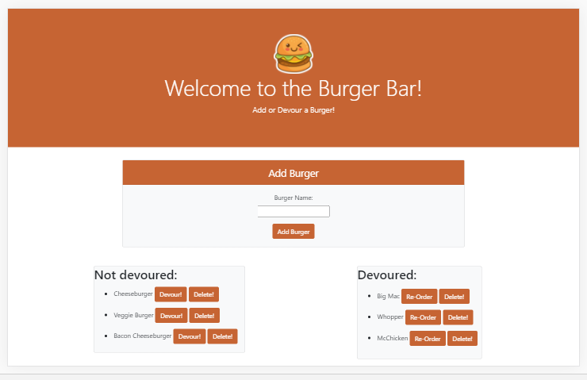

# Burger-App

The Burger App allows a user to input and log burgers they would like to eat or have eaten. The application uses MySQL to store the users data, giving them the option to add burgers to the list, mark burgers as devoured, re-order burgers they loved or delete burgers they no longer want on their list. This application was created with Node, Express, Express-Handlebars and MySQL. 

Please click here to see a live demo of the application.  
https://drive.google.com/file/d/1wCb7-in5bKKakbbi4gnqBtqUbEHBMt3M/view

